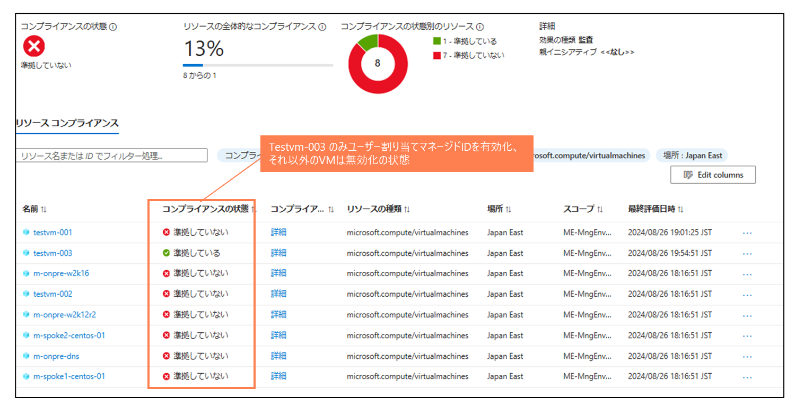

# ユーザー割り当てマネージドIDが適用されていない仮想マシンの検出

> [!NOTE]
> 本説明はChatGPTを利用して作成しています

### 概要
このポリシーは、仮想マシン（VM）にユーザー割り当てマネージドIDが設定されていない場合に監査（Audit）を実行することを目的としています。このポリシーにより、仮想マシンのセキュリティ設定を監視し、マネージドIDの未設定を検出します

### 目的
このポリシーの目的は、VM がユーザー割り当てマネージドIDを持たない場合にその状態を検出し、セキュリティや運用管理の向上を図ることです。マネージドIDは、VM が安全にAzureリソースへアクセスするための認証手段を提供するため、適切に設定されていない場合には監査を行うことで、潜在的なセキュリティリスクを可視化します

### ポリシーの適用条件
このポリシーは、以下の条件を満たすリソースに適用されます
- リソースの種類が Microsoft.Compute/virtualMachines であること
- VM にユーザー割り当てマネージドIDが設定されていない、または空のオブジェクト {} になっていること

これらの条件に該当する VM に対して、監査（Audit）の効果が適用されます

### 本ポリシーの動作についての補足
- 本ポリシーはユーザー割り当てマネージドIDが設定されていない、または空の状態にある VM が検出され、監査レポートに記録される
- 本ポリシーは、強制的にリソースを変更するものではなく、監査を行うことにより現状を可視化することを目的としている

----
検出（コンプライアンスの状態）

