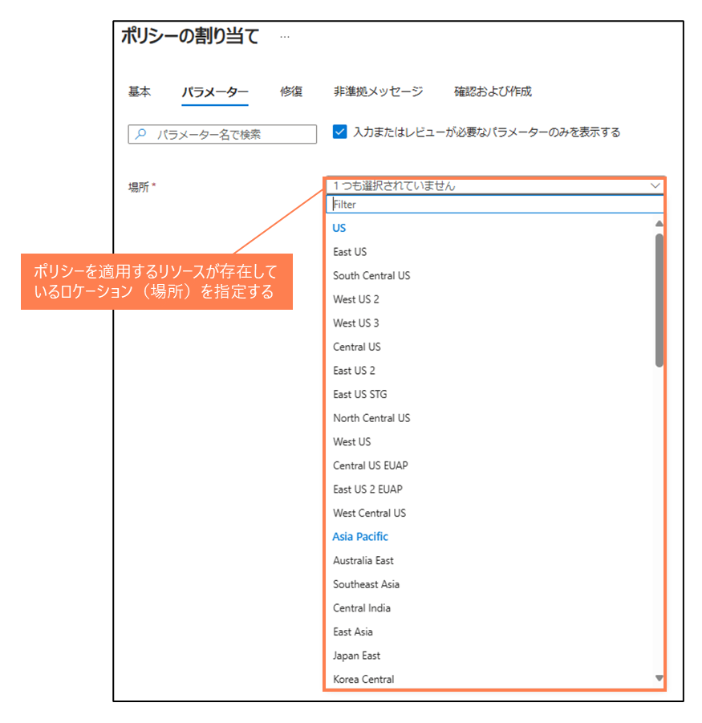
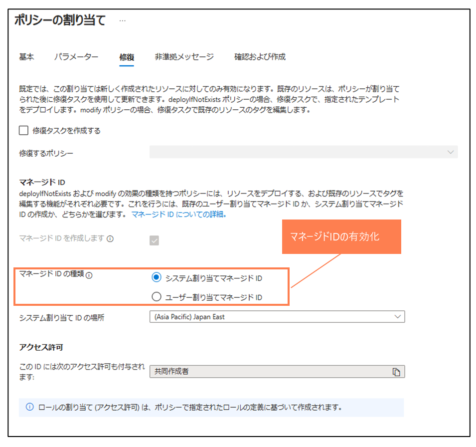
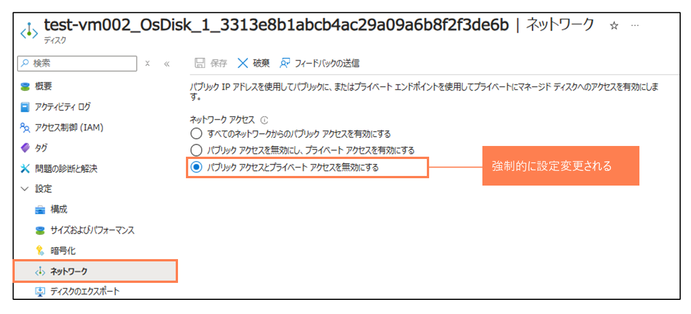

# パブリックネットワークアクセスを無効にするようにマネージド ディスクを構成する

> [!NOTE]
> 本説明はChatGPTを利用して作成しています

### 概要
このポリシーは、特定のリージョンにおける仮想マシンのディスクリソースに対してネットワークアクセスポリシーとパブリックネットワークアクセス設定を強制的に適用することを目的としています。ポリシーが適用されると、対象ディスクのネットワークアクセスが制限され、セキュリティが向上します

### 目的
このポリシーの主な目的は、仮想マシンのディスクが不適切に公開されないようにし、企業や組織のセキュリティポリシーに従って、指定されたリージョンにおけるディスクのネットワークアクセス設定を標準化することです。具体的には、ディスクへのすべてのパブリックネットワークアクセスを無効にし、ネットワークアクセスポリシーを「DenyAll」に設定することを目的としています

### ポリシーの適用条件
このポリシーは、以下の条件を満たすディスクリソースに適用されます

- リソースの種類が Microsoft.Compute/disks であること
- リソースが指定されたリージョン（location パラメータ）に存在すること
- ネットワークアクセスポリシーが DenyAll に設定されていないこと
- パブリックネットワークアクセスが Disabled に設定されていないこと

これらの条件を満たすリソースに対して、ポリシーは指定された「効果」（Modify または Disabled）を実行します

### 本ポリシーの動作についての補足
- ポリシーの割り当ての際に 適用対象とするリソースが存在するlocation（場所）を指定する必要がある
- 効果が "Modify" の場合は、マネージドIDを有効化し適切な権限を与える必要がある
- このポリシーが発動すると、対象ディスクのネットワークアクセスポリシーは「DenyAll」に、パブリックネットワークアクセス設定は「Disabled」に強制的に変更される
- Portalで作成する場合、VM作成時にディスクのネットワーク設定を行うことはできない

----
ロケーションの指定

----
マネージドIDの有効化

----
設定が変更される場所
