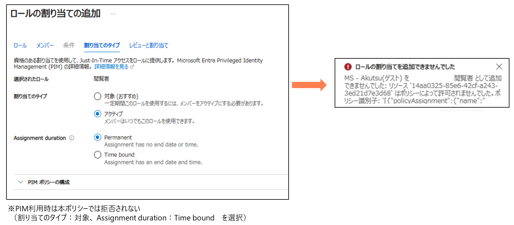

# ロール割り当て操作の制御

> [!NOTE]
> 本説明はChatGPTを利用して作成しています

### 概要
このポリシーは、Azureのロール割り当てリソース (Microsoft.Authorization/roleAssignments) に対する操作を監視および制限することを目的としています。ポリシーの設定により、ロール割り当ての作成や更新が監査されるか、拒否されるかを制御します

### 目的
このポリシーの目的は、Azure環境におけるロール割り当ての管理を強化し、不正な権限付与や誤ったロール割り当てのリスクを低減することです。適切なロール割り当てが行われているかを確認することで、セキュリティとコンプライアンスの向上を図ります

### ポリシーの適用条件
このポリシーは、以下の条件を満たすリソースに適用されます
- リソースの種類が Microsoft.Authorization/roleAssignments であること

この条件を満たすロール割り当てリソースに対して、ポリシーの effect パラメータに従った処理が行われます。

- Audit
  - ロール割り当ての操作が監査され、ログに記録されます。これにより、ロール割り当ての変更が追跡可能となり、問題が発生した際の調査が容易になります

- Deny
  - ロール割り当ての作成や更新が拒否され、ポリシー違反が発生するのを防ぎます

- Disabled
  - ポリシーが無効化され、実行されません。

### 本ポリシーの動作についての補足
- ロールの割り当ては禁止されるが、ロールの削除は可能となる
- 管理グループにポリシーを設定する場合、管理グループ配下のリソースに対するIAM操作(ロール付与)ができなくなるため注意が必要
- 本ポリシーが適用されると管理者でもIAM操作(ロール付与)ができなくなるため注意が必要（作業時にはポリシーを一時無効にするなどの対処が必要となる）
- PIM利用時は本ポリシーでは拒否されない

----
動作イメージ

