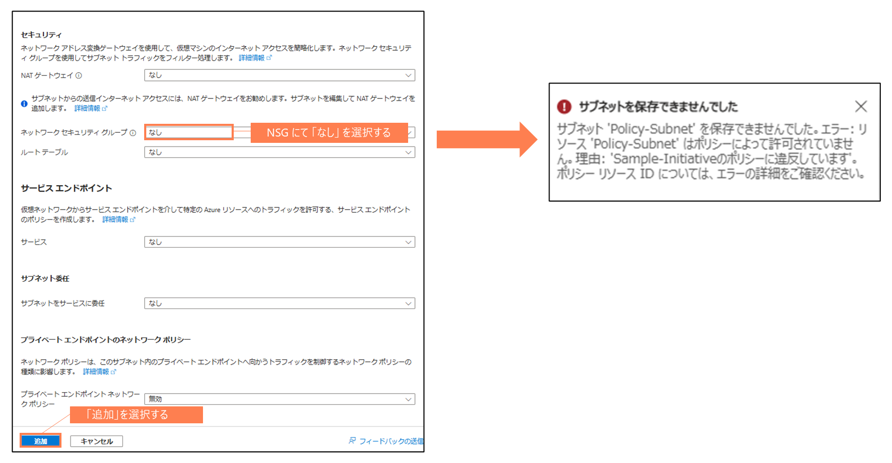

# NSG未設定サブネットの検出と制御

> [!NOTE]
> 本説明はChatGPTを利用して作成しています

### 概要
このポリシーは、仮想ネットワーク（VNet）内のサブネットにネットワークセキュリティグループ（NSG）が設定されていない場合に、その状況を監査、拒否、または無効化することを目的としています。特定のサブネットは除外リストに基づいてポリシー適用の対象外とすることができます

### 目的
このポリシーの主な目的は、仮想ネットワークのサブネットに対するセキュリティを強化することです。NSGはサブネットレベルでのトラフィック制御を可能にし、未設定のサブネットはセキュリティリスクを招く可能性があります。ポリシーは、NSGが適用されていないサブネットを検出し、適切な対応を促すために監査、拒否、または無効化します

### ポリシーの適用条件
このポリシーは、以下の条件を満たすリソースに適用されます
- リソースの種類が Microsoft.Network/virtualNetworks または Microsoft.Network/virtualNetworks/subnets であること
- 仮想ネットワーク内のサブネットにNSGが設定されていないこと
- サブネット名が、excludedSubnetsパラメータで指定された除外リストに含まれていないこと

これらの条件を満たす仮想ネットワークおよびサブネットに対して、ポリシーのeffectパラメータに従った処理が行われます

### 本ポリシーの動作についての補足
このポリシーが適用されると、NSGが設定されていないサブネットが検出されます。effectパラメータの設定に応じて、以下のいずれかのアクションが実行されます

- Audit: ポリシー違反を監査し、ログに記録します
- Deny: ポリシー違反となるリソースの作成や更新を拒否します
- Disabled: ポリシーの実行を無効にします

また、excludedSubnetsパラメータを使用することで、ポリシーの適用対象から特定のサブネット（例：GatewaySubnet、AzureFirewallSubnet、AzureFirewallManagementSubnet）を除外することが可能です

これにより、特定のインフラストラクチャリソースがポリシーの適用外となり、柔軟な管理が可能になります

----
効果がDenyの場合
