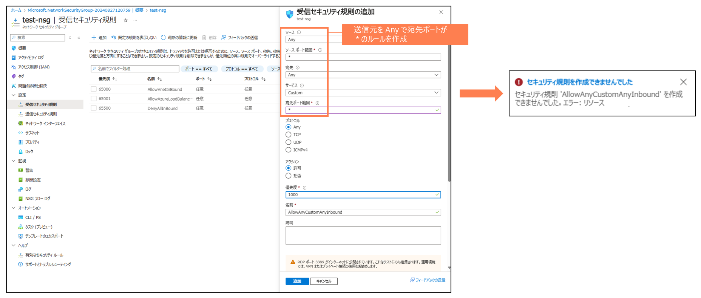

# 不特定ソースからのインバウンドアクセスをNSGで制限する

> [!NOTE]
> 本説明はChatGPTを利用して作成しています

### 概要
このポリシーは、ネットワークセキュリティグループ（NSG）のセキュリティルールにおいて、インバウンドトラフィックを許可し、かつソースアドレスがワイルドカード（*）またはInternetに設定されているルールを禁止することを目的としています。これにより、組織のセキュリティを強化し、不適切なトラフィックの流入を防止します

### 目的
このポリシーの主な目的は、外部からの不正アクセスを防ぐため、セキュリティルールでインバウンドトラフィックを許可し、かつソースアドレスがワイルドカードやInternetに設定されている場合、そのルールの作成や適用を禁止することです。これにより、特定のソースからのみにアクセスを制限し、ネットワークの安全性を確保します

### ポリシーの適用条件
このポリシーは、以下の条件を満たすセキュリティルールに適用されます
- リソースの種類が Microsoft.Network/networkSecurityGroups/securityRules であること
- セキュリティルールがインバウンドトラフィックを許可する設定になっていること
- セキュリティルールのソースアドレスがワイルドカード（*）またはInternetに設定されている、または複数のソースアドレスのいずれかがそれらに該当すること

### 本ポリシーの動作についての補足
- 送信元アドレスが *(Any) や Internet で宛先ポートが *(Any) などのルールの作成が禁止される（宛先ポートが限定されている場合は作成可能）

----
動作イメージ
