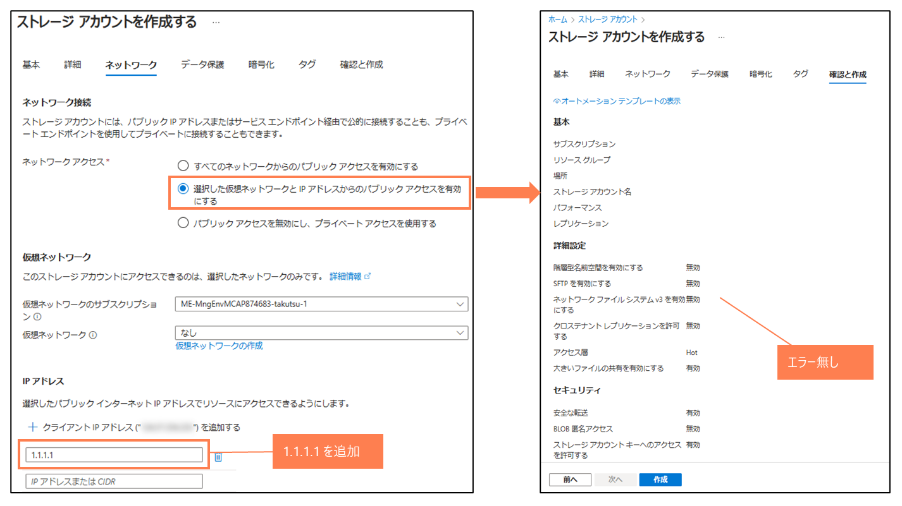

# ストレージ アカウントでは決められたIP(1.1.1.1)からのアクセスに制限する必要がある

> [!NOTE]
> 本説明はChatGPTを利用して作成しています

### 概要
このAzure Policyは、パブリックネットワークアクセスが有効で、かつ特定のネットワークアクセス制御設定に問題があるストレージアカウントに対して適用されます。ポリシーの効果（effect）は Deny、Audit、または Disabled から選択でき、デフォルトでは Deny です

### 目的
このポリシーの目的は、パブリックネットワークアクセスが有効なストレージアカウントに対して、不適切なネットワークアクセス制御設定を防止し、セキュリティを強化することです。特に、デフォルトアクションが Allow に設定されているか、特定のIPアドレス（例：1.1.1.1）が許可リストに含まれていない場合にポリシーを適用します

### ポリシーの適用条件
- リソースの種類: Microsoft.Storage/storageAccounts であること
- パブリックネットワークアクセス: Enabled（有効）であること
- ネットワークACLの条件
    - defaultAction が Allow に設定されている場合
    - またはIPルールに 1.1.1.1 が含まれていない場合

これらの条件を満たす場合、ポリシーが適用され、指定された効果（Deny、Audit など）が実行されます

### 本ポリシーの動作についての補足
- ネットワークアクセスにて「選択した仮想ネットワークとIPアドレスからのパブリックアクセスを有効にする」を設定する必要がある (許可IPアドレスを追加しない状態での作成は可能だが、その場合、どのIPからもアクセス不可となる)
- 「すべてのネットワークからのパブリックアクセスを有効にする」という設定は不可
- 「プライベートアクセスを使用する」という設定は可能
- 指定可能な許可IPアドレスは「1.1.1.1」のみとなる（「1.1.1.1」と「2.2.2.2」の2つを設定するなども不可）

----
動作イメージ
